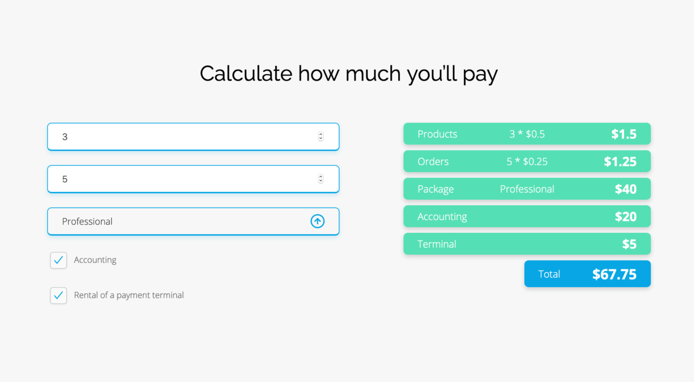

# Website Best Shop

> A responsive One page website as part of the Coders Lab workshop

## Live demo

[https://lukaszkopyto.github.io/Website_Best_Shop/](https://lukaszkopyto.github.io/Website_Best_Shop/)

[https://lukaszkopyto.github.io/Website_Best_Shop/calculate.html](https://lukaszkopyto.github.io/Website_Best_Shop/calculate.html)

## Table of contents

- [General info](#general-info)
- [Screenshots](#screenshots)
- [Technologies](#technologies)
- [Usage](#usage)
- [Features](#features)

## General info

Responsive one-page website as part of the Coders Lab course.

The second part of the workshop was to create a view that calculates the price based on the values from the fields: input, checkbox and select.

## Screenshots

Website Best Shop - index.html

Pricining calculator - calculate.html

## Technologies

- JS
- SASS, RWD
- Gulp
- HTML, CSS
- Google Font :
  - Open Sans
  - Raleway
- Adobe XD

## Usage

After you clone this repo to your desktop, go to its root directory and run `npm install` to install its dependencies.

Once the dependencies are installed, you can run `npm run gulp` to start Gulp, and Browsersync. You will then be able to access it at localhost:3000.

## Features

- RWD, breakpoints:
  - mobile (< 414px, > 570px)
  - tablet (700px - 998px)
  - desktop (> 999px)
- Pixel perfect based on the design in [Adobe XD](https://xd.adobe.com/spec/3e12f9b5-11e7-4d9a-6a6b-e78b20d2a5a6-4823/grid/)
- Smooth scrolling
- Animations (hamburger menu, form input)
- Pricing calculator - [calculate.html](https://lukaszkopyto.github.io/Website_Best_Shop/calculate.html)
